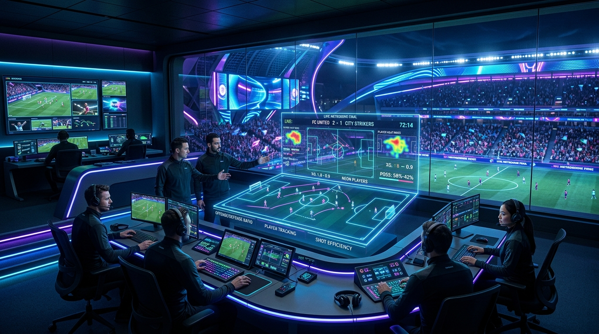
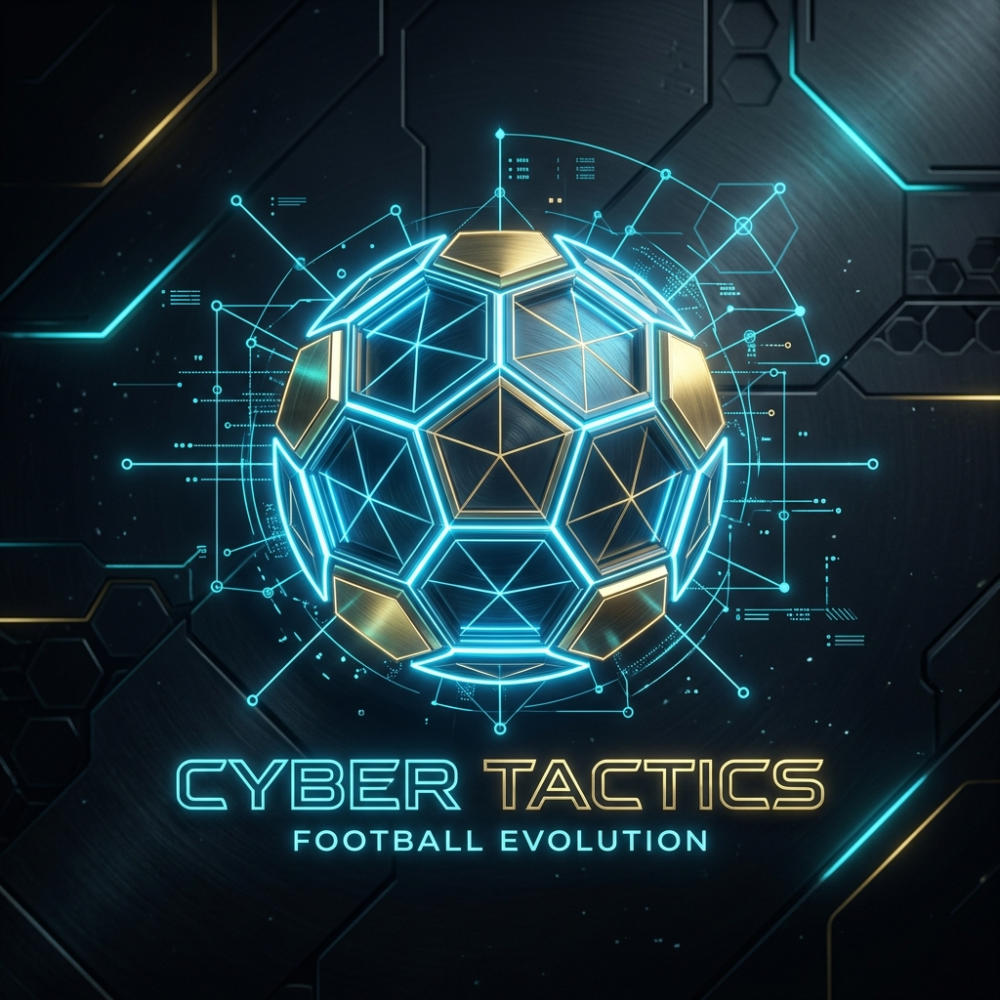

# Sportzfy Sandbox & Tournament Command Center 🏆

An immersive, next-generation live OTT-style sports broadcasting, AI-driven match simulation, and immersive stadium audio orchestration platform with built-in security sandbox simulations.

---

## 📡 Project Overview

**Sportzfy Sandbox** is a hybrid simulation, media orchestration, and broadcast observability operating system. It provides developers and network operators with a safe, interactive environment to test, analyze, and experience sports stream distribution under realistic high-demand conditions. 

The platform merges a **resilient streaming gateway** (with encryption handshakes, signature verification, and CDN failover simulation), an **AI match intelligence dashboard** (tactical insights, live momentum, and "Man of the Match" profiles), and a **procedural audio soundstage** (synthesizing realistic stadium acoustics in real-time) under a unified, high-performance web interface.

---

## 🎨 Professional Visual Previews

Here are the custom generated design concepts depicting the advanced broadcasting control room and tactical artificial intelligence:

### 📡 1. Broadcast Command Center Hero
*An immersive view of the professional live OTT-style broadcast control room, showing signal waveforms, live stream mosaics, and telemetry feeds.*



### 🔮 2. AI Tactical Match Intelligence Badge
*Futuristic badge representing the AI simulation engine that analyzes key player performance indexes and provides tactical verdicts.*

<p align="center">
  
</p>

---

## 🌟 Key Features

### 1. Interactive Tournament Command Center 🏆
A centralized orchestration layer containing:
*   **Championship Bracket:** Live interactive brackets with automated score updates, live progress trackers, and win probability dynamics.
*   **League Standings Table:** Comprehensive points table displaying rank, games played, wins, draws, losses, goal differences, total points, and recent match forms.
*   **AI Tactical Predictions:** Advanced predictive metrics analyzing team configurations, key tactical nodes, and expected Goals (xG).
*   **Stadium Atmosphere Controls:** Ambient preset management to toggle between clear sky acoustics, rain-dampened audio, or dense fog lowpass filter adjustments.

### 2. Live OTT-Style Broadcast Engine 📺
*   **Dynamic Playback Screen:** Interactive player with simulated cryptographic gateway indicators.
*   **Live Mosaic Wall:** A 2x2 multi-view monitoring array displaying multiple real-time live streams simultaneously (Al Jazeera Live, France 24 News, Red Bull TV, and Tears of Steel HD) with instant one-click main screen promotion.
*   **Telemetry Overlay:** Real-time signal metrics monitoring latency spikes, download speed (Mbps), queue buffering, and connection uptime.
*   **Adaptive Failover Routing:** Automatic CDN routing simulation triggered by synthetic packet loss injections.

### 3. Procedural Audio Orchestration 📣
*   **Brownian Crowd Noise:** Generates real-time crowd humming using lowpass-filtered Brownian noise via the Web Audio API without relying on large MP3 assets.
*   **Interactive Soundstage Synthesizer:** Real-time oscillators generating high-frequency dual-tone referee whistles and filter-swept crowd goal cheers.
*   **AI Broadcast Narrator:** Synthesized play-by-play live match commentary using browser Speech Synthesis APIs in both English and Bengali.

### 4. Advanced Security Sandbox 🛡️
*   **Vulnerability Simulations:** Real-time demonstration and testing of stream URL sniffing, token expiration exploitation, SSL/TLS man-in-the-middle spoofing, and User-Agent manipulation.
*   **Defensive Measures:** Implements client-side signature generation, token-bound expiration checks, secure server-side proxies, and user-agent encryption checks.
*   **Interactive Payload Logs:** Real-time timeline highlighting security threats, token blockades, or decrypted feed requests.

---

## 🛠️ Technology Stack

The platform is designed with an industry-grade, highly responsive stack prioritizing performance and low-latency interactions:

*   **Frontend Framework:** React 18+ (TypeScript)
*   **Build Tool & Dev Server:** Vite 
*   **Styling Engine:** Tailwind CSS (fully responsive, custom slate-inspired dark utility classes)
*   **Motion & Transitions:** Framer Motion (`motion/react`)
*   **Icon Library:** Lucide React
*   **Acoustic Synthesizer:** Web Audio API (procedural oscillators, gain envelopes, and audio nodes)
*   **Commentary Engine:** Web Speech Synthesis API
*   **Visualization:** HTML5 Canvas (low-latency wave visualization for telemetry streams)

---

## ⚙️ Setup & Installation Instructions

Follow these instructions to run the Sportzfy platform locally in development or deploy to a production environment.

### Prerequisites
Make sure you have Node.js (version 16 or later) and npm installed.

### 1. Clone the repository and navigate to the directory
```bash
git clone <repository-url>
cd sportzfy-sandbox
```

### 2. Install Dependencies
```bash
npm install
```

### 3. Run Development Server
```bash
npm run dev
```
*The application will boot up at `http://localhost:3000`.*

### 4. Build for Production
```bash
npm run build
```

### 5. Start Production Server
```bash
npm run start
```

---

## 🔒 Security Compliance & Sandbox Disclaimers

### Architectural Security Notes
*   **Zero API Key Exposure:** Any production-grade API keys, CDN decryption secrets, or Google Gemini credentials are kept entirely on the server side (Express/Node backend proxy routes) and never exposed to the client browser.
*   **Dynamic Signatures:** Demonstrates HMAC-SHA256 signature handshakes generated dynamically for each stream session request, mimicking professional platforms like Akamai and Cloudflare Stream.
*   **Secure Proxies:** Configured to tunnel restricted or mixed-content stream assets through a secure reverse proxy layer to bypass local browser CORS (Cross-Origin Resource Sharing) restrictions and prevent mixed-content blocks.

*Disclaimer: The security vulnerabilities simulated in the sandbox are strictly educational and aimed at highlighting standard hardening techniques for sports media developers.*

---

## 🇧🇩 বাংলা পরিচিতি (Bengali Version)

### স্পোর্টজফাই স্যান্ডবক্স ও টুর্নামেন্ট কমান্ড সেন্টার

এটি একটি উচ্চ-মানের লাইভ ওটিটি ব্রডকাস্টিং, কৃত্রিম বুদ্ধিমত্তা-চালিত ক্রীড়া সিমুলেশন এবং প্রসেডিউরাল অডিও অর্কেস্ট্রেশন প্ল্যাটফর্ম যা অত্যন্ত সুরক্ষিত উপায়ে কাজ করে।

#### 🌟 প্রধান প্রযুক্তিগত দিকসমূহ:

*   **ব্রডকাস্ট এবং হ্যান্ডশেক ইঞ্জিন:** নিরাপদ মিডিয়া স্ট্রিমিং ও ডিক্রিপশন গেটওয়ে। এটি রিয়েল-টাইম ক্লায়েন্ট সিগনেচার ভেরিফিকেশন, সিডিএন ফেইলওভার রাউটিং এবং লাইভ টেলিমেট্রি ওভারলে প্রদর্শন করে।
*   **এআই ম্যাচ ইন্টেলিজেন্স:** লাইভ ম্যাচের কৌশলগত বিশ্লেষণ এবং নিখুঁত এআই মোমেন্টাম ট্র্যাকিং সহ "ম্যান অব দ্য ম্যাচ" (MOTM) নির্ণয়ের উন্নত ব্যবস্থা।
*   **প্রসেডিউরাল অডিও সাউন্ডস্টেজ:** কোনো এক্সটার্নাল অডিও ফাইল ছাড়াই সরাসরি ব্রাউজারে ওয়েব অডিও এপিআই (Web Audio API) দিয়ে স্টেডিয়ামের ব্যাকগ্রাউন্ড সাউন্ড (ব্রাউনিয়ান নয়েজ ফিল্টার), রেফারি বাঁশি এবং গোল সেলিব্রেশন সংশ্লেষ করে।
*   **টুর্নামেন্ট কমান্ড সেন্টার:** টুর্নামেন্টের লাইভ ব্র্যাকেট আপডেট, লীগ পয়েন্ট টেবিল এবং স্টেডিয়ামের ডায়নামিক লাইটিং মোড (সূর্যাস্ত, ফ্লাডলাইট এবং কসমিক নিয়ন এরিনা) নিয়ন্ত্রণের হাব।
*   **সুরক্ষা স্যান্ডবক্স:** স্ট্রিমিং ইউআরএল স্নিফিং, টোকেন জালিয়াতি এবং ম্যান-ইন-দ্য-মিডল অ্যাটাকের মতো সাধারণ সাইবার ঝুঁকি পরীক্ষা করার জন্য একটি অনন্য লার্নিং প্ল্যাটফর্ম।

---

*Developed with passion for premium interactive experiences. ⚽✨*
